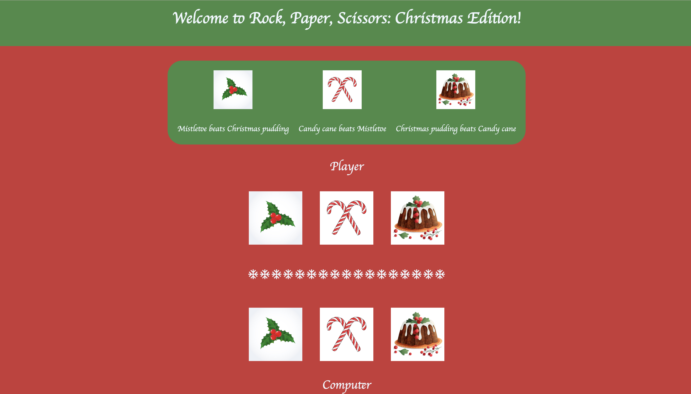
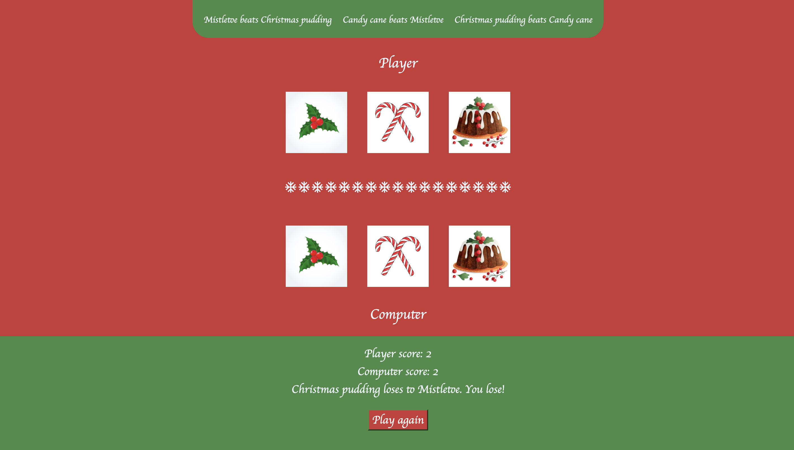

# ⛄ Christmas Rock, Paper, Scissors ⛄

I was inspired by the Christmas period to make a Rock, Paper, Scissors game using well-known Christmas tropes.

## Rules:

- Mistletoe beats Christmas pudding 
- Candy cane beats Mistletoe
- Christmas pudding beats Candy cane

## Live Demo

[**View the live project here**](https://aimei60.github.io/rock-paper-scissors/)

## Languages used:

- HTML5
- CSS3
- Javascript ES6+

## What I learned

- Worked with Javascript (ES6+) to make my game more interactive
- Experience using functions, event listeners and DOM manipulation
- Gained understanding of game logic for example, computer player and tracking scores and defining a winner, loser or a tie.

## Preview

Here is the preview of the game

## Credits:

- Images for the game were taken from https://www.freepik.com

